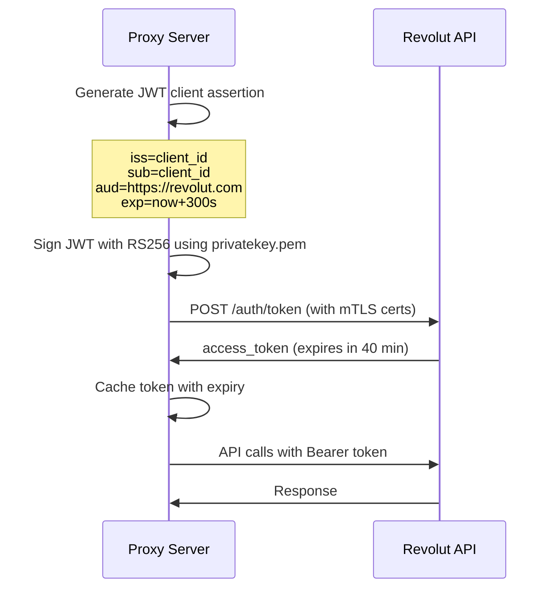

# Bank Integrations Reference - AI Guide

**Purpose:** Comprehensive reference for all banking API integrations, including authentication flows, API quirks, error handling, and troubleshooting.

---

## Table of Contents
1. [Revolut](#revolut)
2. [Mercury](#mercury)
3. [Airwallex](#airwallex)
4. [Wise](#wise)
5. [Nexo](#nexo)
6. [Adding New Banks](#adding-new-banks)

---

## Revolut

### Overview
- **Authentication:** OAuth2 with JWT client assertion + mTLS
- **Base URL:** `https://b2b.revolut.com/api/1.0`
- **Environment:** Production
- **Documentation:** https://developer.revolut.com/docs/business/business-api

### Authentication Flow



### Implementation Details

#### OAuth Token Generation
```javascript
const jwt = require('jsonwebtoken');
const fs = require('fs');
const axios = require('axios');
const https = require('https');

/**
 * Fetches OAuth token for Revolut using JWT client assertion + mTLS
 * @returns {Promise<Object>} Token response with access_token and expires_in
 */
async function getRevolutToken() {
  const clientId = process.env.REVOLUT_CLIENT_ID;
  const privateKey = fs.readFileSync('.secrets/certs/privatekey.pem', 'utf8');

  // 1. Generate JWT client assertion
  const now = Math.floor(Date.now() / 1000);
  const assertion = jwt.sign(
    {
      iss: clientId,        // Issuer = client ID
      sub: clientId,        // Subject = client ID
      aud: 'https://revolut.com',  // CRITICAL: Must be exactly this
      iat: now,             // Issued at
      exp: now + 300        // Expires in 5 minutes
    },
    privateKey,
    { algorithm: 'RS256' } // MUST use RS256
  );

  // 2. Create mTLS HTTPS agent
  const httpsAgent = new https.Agent({
    cert: fs.readFileSync('.secrets/certs/client-cert.pem'),
    key: fs.readFileSync('.secrets/certs/privatekey.pem'),
    ca: fs.readFileSync('.secrets/certs/ca-cert.pem'),
    rejectUnauthorized: true  // Verify server certificate
  });

  // 3. Exchange JWT for access token
  try {
    const response = await axios.post(
      'https://b2b.revolut.com/api/1.0/auth/token',
      {
        grant_type: 'client_credentials',
        client_assertion_type: 'urn:ietf:params:oauth:client-assertion-type:jwt-bearer',
        client_assertion: assertion
      },
      {
        httpsAgent: httpsAgent,
        headers: {
          'Content-Type': 'application/x-www-form-urlencoded'
        }
      }
    );

    console.log('[Revolut] Token obtained successfully');
    return {
      access_token: response.data.access_token,
      expires_in: response.data.expires_in || 2400 // Default 40 minutes
    };

  } catch (error) {
    console.error('[Revolut] Token fetch failed:', error.response?.data || error.message);
    throw new Error(`Revolut OAuth failed: ${error.message}`);
  }
}
```

#### Token Caching
```javascript
let revolutTokenCache = {
  token: null,
  expiresAt: null
};

/**
 * Get cached Revolut token or fetch new one
 * @returns {Promise<string>} Valid access token
 */
async function getRevolutAccessToken() {
  const now = Date.now();
  const buffer = 5 * 60 * 1000; // 5 minute buffer

  // Check if cached token is still valid
  if (revolutTokenCache.token &&
      revolutTokenCache.expiresAt &&
      now < revolutTokenCache.expiresAt - buffer) {
    console.log('[Revolut] Using cached token');
    return revolutTokenCache.token;
  }

  // Fetch new token
  console.log('[Revolut] Fetching new token');
  const tokenData = await getRevolutToken();

  // Cache token
  revolutTokenCache = {
    token: tokenData.access_token,
    expiresAt: now + (tokenData.expires_in * 1000)
  };

  return tokenData.access_token;
}
```

#### Making API Calls
```javascript
/**
 * Makes authenticated request to Revolut API
 * @param {string} endpoint - API endpoint (e.g., '/accounts')
 * @param {string} method - HTTP method (GET, POST, etc.)
 * @param {Object} data - Request body (for POST/PUT)
 * @returns {Promise<Object>} API response
 */
async function callRevolutAPI(endpoint, method = 'GET', data = null) {
  const token = await getRevolutAccessToken();

  const config = {
    method: method,
    url: `https://b2b.revolut.com/api/1.0${endpoint}`,
    headers: {
      'Authorization': `Bearer ${token}`,
      'Content-Type': 'application/json'
    },
    httpsAgent: new https.Agent({
      cert: fs.readFileSync('.secrets/certs/client-cert.pem'),
      key: fs.readFileSync('.secrets/certs/privatekey.pem'),
      ca: fs.readFileSync('.secrets/certs/ca-cert.pem')
    })
  };

  if (data) {
    config.data = data;
  }

  try {
    const response = await axios(config);
    return response.data;
  } catch (error) {
    // Handle 401 by refreshing token and retrying ONCE
    if (error.response?.status === 401) {
      console.log('[Revolut] 401 error, refreshing token...');
      revolutTokenCache = { token: null, expiresAt: null };

      // Retry with new token
      const newToken = await getRevolutAccessToken();
      config.headers.Authorization = `Bearer ${newToken}`;
      const retryResponse = await axios(config);
      return retryResponse.data;
    }

    throw error;
  }
}
```

### API Endpoints

#### Get Accounts
```javascript
// GET /accounts
const accounts = await callRevolutAPI('/accounts');
// Returns: [{ id, name, balance, currency, state }]
```

#### Get Transactions
```javascript
// GET /transactions?from=2024-01-01&to=2024-12-31
const transactions = await callRevolutAPI('/transactions?from=2024-01-01&to=2024-12-31');
// Returns: [{ id, type, request_id, state, created_at, updated_at, completed_at, amount, currency }]
```

#### Transfer Between Accounts
```javascript
// POST /transfer
const transfer = await callRevolutAPI('/transfer', 'POST', {
  request_id: generateUUID(),  // Idempotency key
  source_account_id: 'abc123',
  target_account_id: 'def456',
  amount: 10000,  // In minor units (e.g., cents)
  currency: 'EUR'
});
```

#### Exchange Currency
```javascript
// POST /exchange
const exchange = await callRevolutAPI('/exchange', 'POST', {
  request_id: generateUUID(),
  from: {
    account_id: 'abc123',
    currency: 'USD',
    amount: 10000
  },
  to: {
    account_id: 'def456',
    currency: 'EUR'
  }
});
```

### API Quirks & Gotchas

1. **Token audience MUST be exactly `https://revolut.com`**
   - Not `https://b2b.revolut.com`
   - Not `https://api.revolut.com`

2. **mTLS certificates required for ALL requests**
   - Including OAuth token endpoint
   - Certificates must be from Revolut (not self-signed)

3. **Token expires in 40 minutes**
   - Implement caching with 5-minute buffer
   - Handle 401 responses by refreshing token

4. **Idempotency keys required for mutations**
   - Use `request_id` field
   - Use UUID v4 format
   - Same `request_id` = same operation (safe to retry)

5. **Amounts in minor units**
   - EUR 100.00 = 10000
   - Divide by 100 for display

6. **Rate limit: 1000 requests/hour**
   - Implement exponential backoff on 429 responses

7. **Transaction states:**
   - `pending` - Being processed
   - `completed` - Successfully completed
   - `declined` - Rejected
   - `failed` - Error occurred

### Error Handling

```javascript
try {
  const result = await callRevolutAPI('/transfer', 'POST', transferData);
} catch (error) {
  if (error.response) {
    switch (error.response.status) {
      case 401:
        // Token expired - already handled in callRevolutAPI
        break;
      case 403:
        // Insufficient permissions
        console.error('[Revolut] Permission denied');
        break;
      case 429:
        // Rate limited
        console.error('[Revolut] Rate limit exceeded');
        // Implement exponential backoff
        break;
      case 500:
        // Server error
        console.error('[Revolut] Server error, retry later');
        break;
      default:
        console.error(`[Revolut] API error ${error.response.status}:`, error.response.data);
    }
  } else {
    console.error('[Revolut] Network error:', error.message);
  }
  throw error;
}
```

### Setup Requirements

1. **Obtain credentials from Revolut:**
   - Register for Business API access
   - Generate client ID
   - Generate and download mTLS certificates

2. **Store certificates:**
   ```
   .secrets/certs/
   ├── client-cert.pem    # Client certificate
   ├── privatekey.pem     # Private key (for JWT + mTLS)
   └── ca-cert.pem        # CA certificate
   ```

3. **Environment variables:**
   ```bash
   REVOLUT_CLIENT_ID=your_client_id_here
   ```

4. **Verify certificate validity:**
   ```bash
   openssl x509 -in .secrets/certs/client-cert.pem -noout -dates
   openssl rsa -in .secrets/certs/privatekey.pem -check
   ```

---

## Mercury

### Overview
- **Authentication:** API Token (Bearer)
- **Base URL:** `https://api.mercury.com/api/v1`
- **Environment:** Production
- **Documentation:** https://docs.mercury.com

### Authentication Flow

Simple Bearer token authentication - no OAuth required.

```javascript
const axios = require('axios');

/**
 * Makes authenticated request to Mercury API
 * @param {string} endpoint - API endpoint
 * @returns {Promise<Object>} API response
 */
async function callMercuryAPI(endpoint) {
  const apiKey = process.env.MERCURY_API_KEY;

  const response = await axios.get(
    `https://api.mercury.com/api/v1${endpoint}`,
    {
      headers: {
        'Authorization': `Bearer ${apiKey}`,
        'Content-Type': 'application/json'
      }
    }
  );

  return response.data;
}
```

### API Endpoints

#### Get Accounts
```javascript
// GET /accounts
const accounts = await callMercuryAPI('/accounts');
// Returns: { accounts: [{ id, name, accountNumber, routingNumber, type, status }] }
```

#### Get Account Balance
```javascript
// GET /account/:id
const account = await callMercuryAPI(`/account/${accountId}`);
// Returns: { id, availableBalance, currentBalance, currency }
// NOTE: Amounts in cents (divide by 100)
```

#### Get Transactions
```javascript
// GET /account/:id/transactions?start=2024-01-01&end=2024-12-31
const transactions = await callMercuryAPI(
  `/account/${accountId}/transactions?start=2024-01-01&end=2024-12-31`
);
// Returns: { transactions: [{ id, amount, status, createdAt, counterpartyName, note }] }
```

#### Initiate Transfer
```javascript
// POST /account/:id/transactions
const transfer = await axios.post(
  `https://api.mercury.com/api/v1/account/${accountId}/transactions`,
  {
    amount: 10000,  // In cents
    counterpartyId: 'recipient_id',
    note: 'Payment description'
  },
  {
    headers: {
      'Authorization': `Bearer ${process.env.MERCURY_API_KEY}`,
      'Content-Type': 'application/json'
    }
  }
);
```

### API Quirks & Gotchas

1. **Amounts in cents (USD only)**
   - $100.00 = 10000
   - Always divide by 100 for display

2. **Date filtering uses ISO 8601 format**
   - Use: `2024-01-01` or `2024-01-01T00:00:00Z`
   - Not: `01/01/2024`

3. **Rate limit: 60 requests per minute**
   - 429 response when exceeded
   - Implement exponential backoff

4. **Transaction status values:**
   - `pending` - Processing
   - `sent` - Completed successfully
   - `cancelled` - Cancelled by user
   - `failed` - Failed to process

5. **No webhooks for transaction updates**
   - Must poll for updates
   - Recommended: Poll every 5 minutes

6. **Account types:**
   - `checking` - Standard checking account
   - `savings` - Savings account (may have withdrawal limits)

### Error Handling

```javascript
try {
  const data = await callMercuryAPI('/accounts');
} catch (error) {
  if (error.response) {
    switch (error.response.status) {
      case 401:
        console.error('[Mercury] Invalid API key');
        break;
      case 404:
        console.error('[Mercury] Resource not found');
        break;
      case 429:
        console.error('[Mercury] Rate limit exceeded (60/min)');
        // Wait 60 seconds before retry
        break;
      case 500:
        console.error('[Mercury] Server error');
        break;
      default:
        console.error(`[Mercury] API error ${error.response.status}`);
    }
  }
  throw error;
}
```

### Setup Requirements

1. **Obtain API key from Mercury dashboard**
2. **Environment variable:**
   ```bash
   MERCURY_API_KEY=your_api_key_here
   ```

---

## Airwallex

### Overview
- **Authentication:** OAuth2 Client Credentials
- **Base URL:** `https://api.airwallex.com/api/v1`
- **Environment:** Production
- **Documentation:** https://www.airwallex.com/docs/api

### Authentication Flow

```javascript
const axios = require('axios');

let airwallexTokenCache = {
  token: null,
  expiresAt: null
};

/**
 * Fetches OAuth token for Airwallex
 * @returns {Promise<string>} Access token
 */
async function getAirwallexToken() {
  const now = Date.now();
  const buffer = 5 * 60 * 1000; // 5 minute buffer

  // Check cache
  if (airwallexTokenCache.token &&
      airwallexTokenCache.expiresAt &&
      now < airwallexTokenCache.expiresAt - buffer) {
    return airwallexTokenCache.token;
  }

  // Fetch new token
  const response = await axios.post(
    'https://api.airwallex.com/api/v1/authentication/login',
    {
      client_id: process.env.AIRWALLEX_CLIENT_ID,
      client_secret: process.env.AIRWALLEX_CLIENT_SECRET
    },
    {
      headers: {
        'Content-Type': 'application/json'
      }
    }
  );

  const token = response.data.token;
  const expiresIn = response.data.expires_at
    ? new Date(response.data.expires_at).getTime() - now
    : 30 * 60 * 1000; // Default 30 minutes

  // Cache token
  airwallexTokenCache = {
    token: token,
    expiresAt: now + expiresIn
  };

  return token;
}

/**
 * Makes authenticated request to Airwallex API
 */
async function callAirwallexAPI(endpoint, method = 'GET', data = null) {
  const token = await getAirwallexToken();

  const config = {
    method: method,
    url: `https://api.airwallex.com/api/v1${endpoint}`,
    headers: {
      'Authorization': `Bearer ${token}`,
      'Content-Type': 'application/json'
    }
  };

  if (data) {
    config.data = data;
  }

  try {
    const response = await axios(config);
    return response.data;
  } catch (error) {
    // Handle 401 by refreshing token
    if (error.response?.status === 401) {
      airwallexTokenCache = { token: null, expiresAt: null };
      const newToken = await getAirwallexToken();
      config.headers.Authorization = `Bearer ${newToken}`;
      const retryResponse = await axios(config);
      return retryResponse.data;
    }
    throw error;
  }
}
```

### API Endpoints

#### Get Balances
```javascript
// GET /balances
const balances = await callAirwallexAPI('/balances');
// Returns: { items: [{ currency, available_amount, total_amount }] }
```

#### Get Transactions
```javascript
// GET /transactions?from_created_at=2024-01-01
const transactions = await callAirwallexAPI('/transactions?from_created_at=2024-01-01');
// Returns: { items: [{ id, amount, currency, status, created_at }] }
```

### API Quirks & Gotchas

1. **Token expires in 30 minutes**
   - Implement caching
   - Handle 401 responses

2. **Amounts in decimal format**
   - EUR 100.00 = 100.00 (not cents)
   - No conversion needed

3. **Multi-currency support**
   - Each balance has separate currency
   - Check currency field before summing

4. **Rate limit: 100 requests/minute**

5. **Date parameters use ISO 8601**
   - `from_created_at=2024-01-01T00:00:00Z`

### Setup Requirements

```bash
AIRWALLEX_CLIENT_ID=your_client_id
AIRWALLEX_CLIENT_SECRET=your_client_secret
```

---

## Wise

### Overview
- **Authentication:** API Token (Bearer)
- **Base URL:** `https://api.transferwise.com`
- **Environment:** Production
- **Documentation:** https://docs.wise.com/api-docs

### Authentication

```javascript
/**
 * Makes authenticated request to Wise API
 */
async function callWiseAPI(endpoint) {
  const response = await axios.get(
    `https://api.transferwise.com${endpoint}`,
    {
      headers: {
        'Authorization': `Bearer ${process.env.WISE_API_TOKEN}`,
        'Content-Type': 'application/json'
      }
    }
  );
  return response.data;
}
```

### API Endpoints

#### Get Profile ID
```javascript
// GET /v1/profiles
const profiles = await callWiseAPI('/v1/profiles');
const profileId = profiles[0].id; // Usually first profile
```

#### Get Balances
```javascript
// GET /v4/profiles/:profileId/balances
const balances = await callWiseAPI(`/v4/profiles/${profileId}/balances`);
// Returns: [{ id, currency, amount: { value, currency } }]
```

### API Quirks & Gotchas

1. **Need profile ID for most operations**
   - Fetch once and cache
   - Usually use first profile

2. **Amounts in decimal format**
   - EUR 100.00 = 100.00

3. **Rate limit: 180 requests/minute**

4. **Strong Customer Authentication (SCA) required for transfers**
   - May require additional verification step

### Setup Requirements

```bash
WISE_API_TOKEN=your_api_token
```

---

## Nexo

### Overview
- **Authentication:** Email/Password + TOTP 2FA (via Puppeteer)
- **Method:** Browser automation (no public API)
- **Base URL:** `https://platform.nexo.io`

### ⚠️ WARNING
This integration is **fragile** and will break if Nexo changes their UI. It uses browser automation to scrape data.

### Implementation

```javascript
const puppeteer = require('puppeteer');
const speakeasy = require('speakeasy');
const fs = require('fs');

/**
 * Fetches balance from Nexo using Puppeteer
 * @returns {Promise<Object>} { usd: number }
 */
async function getNexoBalance() {
  const browser = await puppeteer.launch({
    headless: true, // Set to false for debugging
    args: ['--no-sandbox', '--disable-setuid-sandbox']
  });

  try {
    const page = await browser.newPage();

    // 1. Load saved cookies if they exist
    const cookiesPath = '.secrets/nexo.cookies.json';
    if (fs.existsSync(cookiesPath)) {
      const cookies = JSON.parse(fs.readFileSync(cookiesPath, 'utf8'));
      await page.setCookie(...cookies);
      console.log('[Nexo] Loaded saved cookies');
    }

    // 2. Navigate to dashboard
    await page.goto('https://platform.nexo.io/dashboard', {
      waitUntil: 'networkidle2',
      timeout: 30000
    });

    // 3. Check if already logged in
    const isLoggedIn = await page.evaluate(() => {
      return document.querySelector('.balance-container') !== null;
    });

    if (!isLoggedIn) {
      console.log('[Nexo] Not logged in, performing login...');

      // 4. Go to login page
      await page.goto('https://platform.nexo.io/login', {
        waitUntil: 'networkidle2'
      });

      // 5. Fill email
      await page.waitForSelector('input[type="email"]');
      await page.type('input[type="email"]', process.env.NEXO_EMAIL);

      // 6. Fill password
      await page.waitForSelector('input[type="password"]');
      await page.type('input[type="password"]', process.env.NEXO_PASSWORD);

      // 7. Click login button
      await page.click('button[type="submit"]');

      // 8. Wait for 2FA prompt
      await page.waitForSelector('input[name="otp"]', { timeout: 10000 });

      // 9. Generate TOTP code
      const totp = speakeasy.totp({
        secret: process.env.NEXO_2FA_SECRET,
        encoding: 'base32'
      });

      // 10. Fill TOTP code
      await page.type('input[name="otp"]', totp);

      // 11. Submit
      await page.click('button[type="submit"]');

      // 12. Wait for dashboard
      await page.waitForNavigation({ waitUntil: 'networkidle2' });

      // 13. Save cookies for next time
      const cookies = await page.cookies();
      fs.writeFileSync(cookiesPath, JSON.stringify(cookies, null, 2));
      console.log('[Nexo] Saved cookies');
    }

    // 14. Scrape balance
    const balance = await page.evaluate(() => {
      const balanceElement = document.querySelector('.balance-usd');
      if (!balanceElement) return null;

      const text = balanceElement.textContent.trim();
      // Extract number from "$1,234.56" format
      const number = text.replace(/[$,]/g, '');
      return parseFloat(number);
    });

    if (balance === null) {
      throw new Error('Failed to find balance element');
    }

    return { usd: balance };

  } finally {
    await browser.close();
  }
}
```

### Selectors (as of 2024)

**⚠️ These may change without notice:**

- Email input: `input[type="email"]`
- Password input: `input[type="password"]`
- Submit button: `button[type="submit"]`
- OTP input: `input[name="otp"]`
- Balance element: `.balance-usd`

### API Quirks & Gotchas

1. **UI changes break everything**
   - Monitor for changes
   - Run with `headless: false` to debug

2. **Slow performance**
   - Takes 10-30 seconds per request
   - Cache aggressively (15+ minutes)

3. **Cookie expiration**
   - Cookies last ~7 days
   - Delete `nexo.cookies.json` to force fresh login

4. **TOTP timing**
   - TOTP codes expire every 30 seconds
   - If login fails, wait 30s and retry

5. **Rate limiting**
   - Limit to 1 request per 5 minutes
   - Nexo may flag frequent logins as suspicious

6. **Headless detection**
   - Nexo may detect Puppeteer
   - Use stealth plugins if needed

### Error Handling

```javascript
try {
  const balance = await getNexoBalance();
  return { success: true, data: balance };
} catch (error) {
  console.error('[Nexo] Error:', error.message);

  // Common errors
  if (error.message.includes('balance element')) {
    // UI changed - selectors need updating
    console.error('[Nexo] UI may have changed, check selectors');
  } else if (error.message.includes('timeout')) {
    // Network issue or slow page load
    console.error('[Nexo] Timeout - retry with longer timeout');
  }

  // Delete cookies and retry
  if (fs.existsSync('.secrets/nexo.cookies.json')) {
    fs.unlinkSync('.secrets/nexo.cookies.json');
    console.log('[Nexo] Deleted stale cookies');
  }

  throw error;
}
```

### Setup Requirements

```bash
NEXO_EMAIL=your_email@example.com
NEXO_PASSWORD=your_password
NEXO_2FA_SECRET=your_totp_secret_key
```

**Getting TOTP secret:**
1. Enable 2FA in Nexo settings
2. Choose "Manual entry" instead of QR code
3. Copy the secret key (base32 format)
4. Store in environment variable

---

## Adding New Banks

### Checklist

#### 1. Proxy Server (server.js)

```javascript
// Add authentication function
async function getNewBankToken() {
  // Implement OAuth or API key logic
}

// Add cache if using OAuth
let newBankTokenCache = {
  token: null,
  expiresAt: null
};

// Add API wrapper
async function callNewBankAPI(endpoint, method = 'GET', data = null) {
  // Implement authenticated API calls
}

// Add endpoints
app.get('/newbank/summary', async (req, res) => {
  try {
    const data = await callNewBankAPI('/accounts');
    res.json({ success: true, data: data });
  } catch (error) {
    res.status(500).json({ success: false, error: error.message });
  }
});

app.get('/newbank/transactions', async (req, res) => {
  // Implement transaction fetching
});

// Add to health check
app.get('/healthz', async (req, res) => {
  const checks = {
    server: 'ok',
    revolut: await checkRevolutHealth(),
    mercury: await checkMercuryHealth(),
    newbank: await checkNewBankHealth() // Add this
  };
  res.json(checks);
});
```

#### 2. Google Apps Script (gs_torx_main.gs)

```javascript
/**
 * Fetches summary from new bank
 * @returns {Object} { usd: number, eur: number }
 */
function fetchNewBankSummary_() {
  try {
    const data = httpGet_('/newbank/summary');
    return {
      usd: data.usd || 0,
      eur: data.eur || 0
    };
  } catch (error) {
    console.error('[fetchNewBankSummary_] Error:', error);
    throw error;
  }
}

// Update balance update function
function updateBalances_() {
  // ... existing code ...

  // Add new bank
  const newBank = fetchNewBankSummary_();

  // Update sheet (add new column)
  const sheet = SpreadsheetApp.getActiveSpreadsheet()
    .getSheetByName('Payouts');
  sheet.getRange(2, 8).setValue(newBank.usd); // Column H
}

// Add menu item
function onOpen() {
  const ui = SpreadsheetApp.getUi();
  ui.createMenu('Torx')
    .addItem('Update Balances', 'updateBalances_')
    .addItem('Test New Bank', 'testNewBank_')
    .addToUi();
}

function testNewBank_() {
  const result = fetchNewBankSummary_();
  Browser.msgBox('New Bank Test', JSON.stringify(result, null, 2), Browser.Buttons.OK);
}
```

#### 3. Update Sheet Structure

1. Add column to "Payouts" sheet (e.g., Column H for new bank)
2. Add header: "NewBank USD"
3. Update column constants in code

#### 4. Update Documentation

1. Add to [BANK_INTEGRATIONS.md](BANK_INTEGRATIONS.md) (this file)
2. Update [ARCHITECTURE.md](ARCHITECTURE.md)
3. Update main [README.md](README.md)
4. Add to `.env.example`

#### 5. Environment Variables

```bash
# Add to .env.example and .env
NEWBANK_API_KEY=your_api_key
NEWBANK_CLIENT_ID=your_client_id
NEWBANK_CLIENT_SECRET=your_secret
```

#### 6. Testing

```bash
# Test proxy endpoint
curl -H "x-api-key: YOUR_KEY" http://localhost:52018/newbank/summary

# Test from GAS
# Run testNewBank_() function in Apps Script editor

# Test balance update
# Run updateBalances_() function
```

---

## Common Issues & Solutions

### Issue: "Token expired" errors

**Solution:**
1. Check token cache expiry logic
2. Ensure 5-minute buffer before expiry
3. Handle 401 responses by refreshing token
4. Verify clock sync on server

### Issue: mTLS certificate errors (Revolut)

**Solution:**
```bash
# Check certificate validity
openssl x509 -in .secrets/certs/client-cert.pem -noout -dates

# Verify private key
openssl rsa -in .secrets/certs/privatekey.pem -check

# Test mTLS connection
curl --cert .secrets/certs/client-cert.pem \
     --key .secrets/certs/privatekey.pem \
     --cacert .secrets/certs/ca-cert.pem \
     https://b2b.revolut.com/api/1.0/accounts
```

### Issue: Rate limit errors

**Solution:**
1. Implement exponential backoff
2. Cache responses when possible
3. Respect rate limits:
   - Mercury: 60/min
   - Revolut: 1000/hour
   - Airwallex: 100/min
   - Wise: 180/min

### Issue: Puppeteer fails (Nexo)

**Solution:**
1. Delete `.secrets/nexo.cookies.json`
2. Run with `headless: false` to debug
3. Update selectors if UI changed
4. Check TOTP secret is correct

---

## Rate Limits Summary

| Bank | Rate Limit | Recommended Cache TTL |
|------|------------|----------------------|
| Revolut | 1000/hour | 5 minutes |
| Mercury | 60/minute | 5 minutes |
| Airwallex | 100/minute | 5 minutes |
| Wise | 180/minute | 5 minutes |
| Nexo | 1/5min (Puppeteer) | 15+ minutes |

---

## Security Checklist

- [ ] All credentials in `.env` (never hardcode)
- [ ] `.env` in `.gitignore`
- [ ] Certificates have correct permissions (chmod 600)
- [ ] API keys redacted in logs
- [ ] Token refresh logic implemented
- [ ] HTTPS for all API calls
- [ ] Error messages don't leak credentials
- [ ] Rate limiting implemented
- [ ] Request timeouts configured

---

**Last Updated:** 2025-10-17
**Document Version:** 1.0
